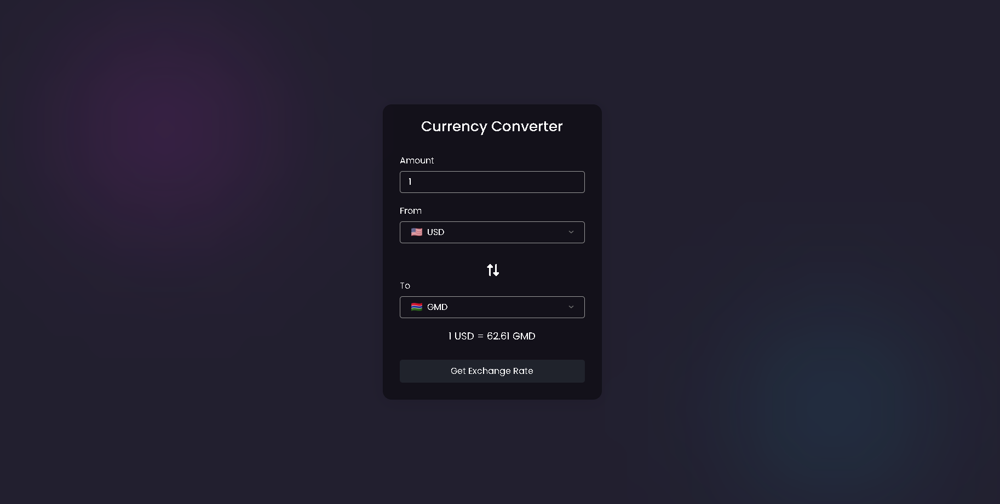
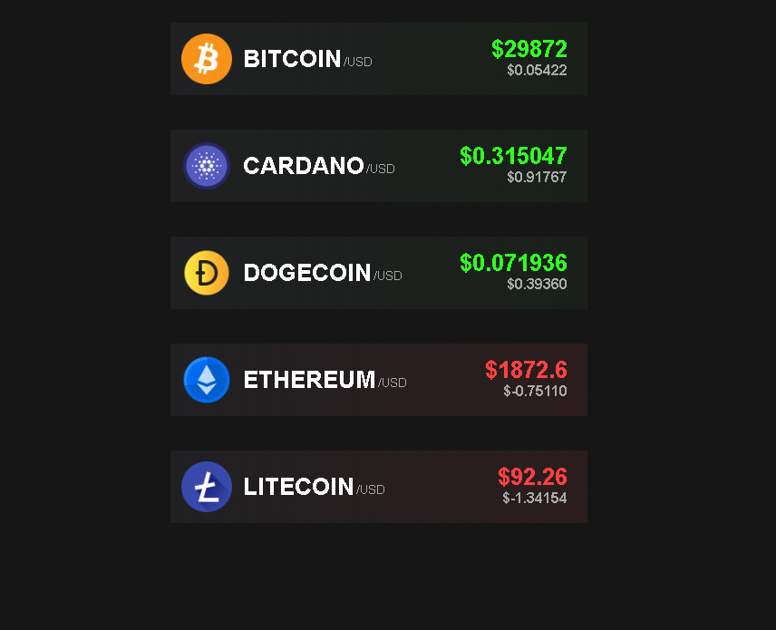

# 100-Days-Coding-Projects --
 
1. Day #1 - Weather App (JavaScript, HTML, CSS) .

2. Day #2 - Crypto Currency App (JavaScript, HTML, CSS) .

3. Day #3 - Crypto Price App (Javascript, Html, CSS) .

4. Day #4 - Stock Tracking App (Javascript, Html, CSS) .

5. Day #5 - Text to Speech App (Javascript, Html, CSS) .

